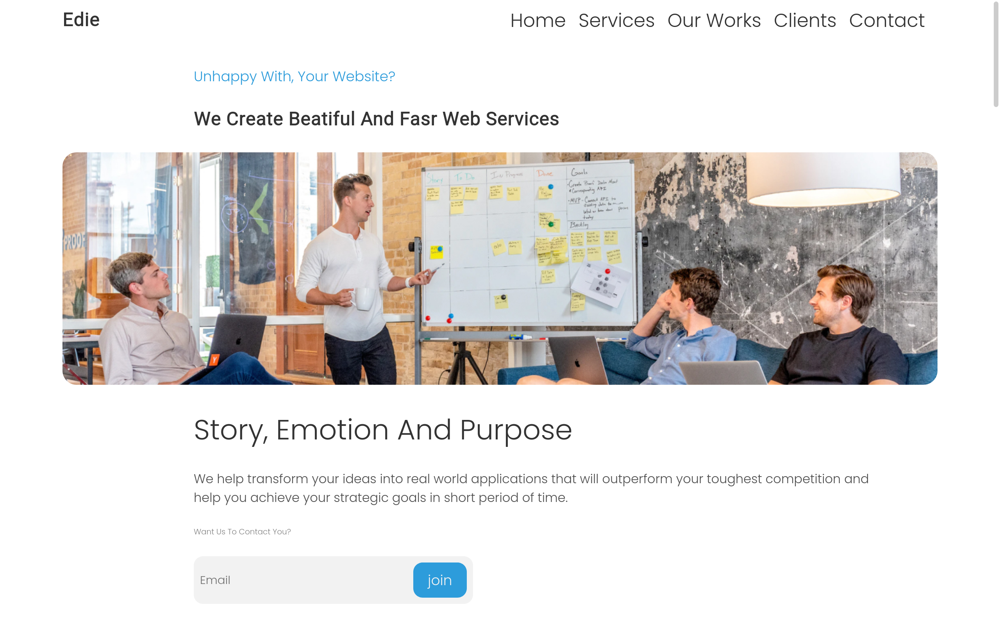

<main>
<section>
    <h1 align="center"> Edie Homepage Master  </h1>
</section>
 <section>
    <h3 align="center"> Solución para un desafío de <a href="https://devchallenges.io/">Devchallenges.io</a> </h3>

<section align="left">
     <h2> Tabla de Contenido </h2>
</section>
<nav>
    <ul>
        <li><a href="https://github.com/jean-carlos-19/checkout-page-master/blob/master/README.md#-descripci%C3%B2n-general-">Descripciòn General</a></li>
        <li><a href="https://github.com/jean-carlos-19/edie-homepage-master#-soluci%C3%B2n-md#-soluci%C3%B2n-">Soluciòn</a></li>
        <li><a href="https://github.com/jean-carlos-19/edie-homepage-master#-construido-con-">Construido Con</a></li>
        <li><a href="https://github.com/jean-carlos-19/edie-homepage-master#-caracteristicas-">Caracteristicas</a></li>
        <li><a href="https://github.com/jean-carlos-19/edie-homepage-master#-contacto-">Contacto</a></li>    
    </ul>
</nav>
<section >
    <section>
        <h2 > Descripciòn General </h2>
    </section>
    <section >
         
    <section>
   
</section>

</section>
    <section >
    <h2> Soluciòn </h2>
    <nav>
        <ul align="center">
            <h3>
                <a href="https://piguavejc-edie-homepage-master.onrender.com/">Demo</a> | 
                <a href="https://github.com/jean-carlos-19/checkout-page-master">Github </a> | 
                <a href="https://devchallenges.io/solutions/o47v88SRgbWN0Q64kclf">Devchallenge</a> </a> | 
                <a href="https://www.figma.com/proto/ahnGupP4JjTdVJDTRfMRF2/edie-homepage?node-id=0%3A1&scaling=min-zoom&page-id=0%3A1">Figma<a>
            </h3>
        </ul>
    </nav>
</section>

<section >
    <section>
        <h2> Construido Con </h2>
    </section>
    <nav>
        <ul>
            <li>HTML</li>
            <li>CSS</li>
            <li>JAVASCRIPT </li> 
            <li>WEBPACK</li> 
            <li>
                Preprocesadores
                <ul>
                    <li>SASS</li>
                </ul>
            </li>
        </ul>
    </nav>
</section>
<section >
    <h2> Caracteristicas </h2>
    

        Esta aplicación o sitio fue creada como una presentación a un desafío de <a href="http://devchallenges.io" target="_blank">Devchallenges.io</a>. El reto consistía en construir una aplicación para completar las historias de usuario dadas.
        Reto: Crea una página estática con HTML y CSS siguiendo los diseños. No mire la solución existente. Cumplir con las historias de usuario a continuación:
    

      <nav>
        <ul>
            <li>Historia de usuario: puedo ver una página siguiendo el diseño dado</li>
            <li>Historia de usuario: puedo ver una página en el móvil siguiendo el diseño dado</li>
            <li>Historia de usuario: puedo ir a determinadas ubicaciones seleccionando enlaces en la navegación o en el pie de página </li> 
            <li>Sorpréndeme con la navegación móvil.</li> 
        </ul>
    </nav>
</section>
<section >
     <section>
        <h2> Contacto </h2>
    </section>
    <nav>
        <ul>
                <li>Github <a href="https://github.com/jean-carlos-19">@jean-carlos-19</a></li>
                <li>Twitter <a href="https://twitter.com/PiguaveJean">@PiguaveJean</a></li>
        </ul>
</nav>
</section>
</main>
